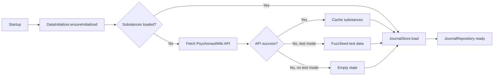
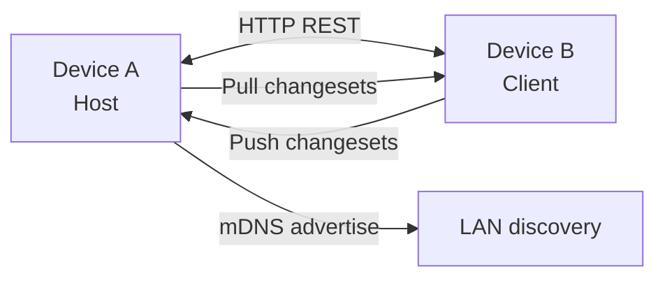

[](LICENSE)
[]()
[]()
[]()
[]()
[]()

# Nepenthe Journal

Offline-first journal for tracking psychoactive substance sessions, monitoring tolerance, and browsing PsychonautWiki reference data. Built with Compose Multiplatform.

No cloud, no accounts, no surveillance. Data lives on your device. Optional P2P sync between your own devices over LAN.

---

## Problem

Existing substance tracking tools require accounts, upload data to servers, or lack structured session logging with tolerance tracking. Nepenthe Journal is a private, offline-first alternative: your data never leaves your devices. P2P sync connects your own devices directly over LAN with no cloud relay.

---

## Features

- **Session tracking:** log sessions with substances, doses, ROAs, check-ins, and timeline events
- **Substance reference:** browse and search substances with dosage, duration, and interaction data from PsychonautWiki
- **Tolerance dashboard:** per-substance tolerance overview based on last ingestion time and frequency
- **Activity heatmap:** visual calendar of session frequency over time
- **P2P sync:** sync your journal between desktop and phone over LAN via Ktor (no cloud relay)
- **Custom theme editor:** full color customization with hex color pickers, card styles, background images, and opacity
- **Harm reduction reference:** built-in safer use guidelines
- **Import/Export:** JSON export and import for backup and transfer
- **Offline-first:** full functionality without internet. PsychonautWiki data is cached locally after first fetch

---

## Architecture

### Navigation

Overlay-based navigation with 5 bottom tabs and full-screen overlay editors:

- **Dashboard:** greeting, stats cards, tolerance overview per substance
- **Sessions:** session list with tag filters, favorites toggle, calendar access
- **Substances:** catalog with search, category chips, custom substance creation
- **Safer Use:** harm reduction reference cards
- **Settings:** theme editor with hex color pickers, P2P sync controls, data import/export

Overlays replace the content area for editors, detail views, and the calendar.

### Data Flow



Persistence uses a single JSON file (`JournalSnapshot`) with all documents serialized via kotlinx.serialization. The repository is an in-memory `StateFlow`-backed store that follows the same interface the Couchbase Lite layer will implement.

### P2P Sync

LAN-based sync using Ktor (no cloud, no Couchbase Enterprise):

- **Host (JVM):** Ktor server advertises via mDNS (JmDNS), accepts push/pull sync requests
- **Client (all targets):** Ktor client pushes local changes and pulls remote changes
- **Conflict resolution:** `updatedAt` comparison with conflict notes for divergent documents
- All sync controls are in Settings under a collapsible "Device Sync" section



### Theme System

Modular, serializable theme system:

- `ThemeConfig`: all visual parameters (colors, card style, corner radius, background image, base theme)
- `ThemeManager`: observable `StateFlow<ThemeConfig>`, derives WCAG-compliant Material3 `ColorScheme`
- Contrast colors computed via relative luminance (WCAG): black or white text depending on background
- Presets: Forest (dark green) and Meadow (light green) defaults
- Persistent across sessions (stored as part of JournalSnapshot)

---

## Getting Started

### Prerequisites

- JDK 21+ (Temurin recommended)
- Android SDK at `D:\Android\sdk` (for Android builds)
- Gradle wrapper included

### Desktop (primary)

```bash
# Run with test data for UI verification
NEPENTHE_TEST_DATA=1 ./gradlew composeApp:run

# Run without test data (empty app)
./gradlew composeApp:run
```

The desktop app launches a native window via Compose Desktop. Test data mode populates 25-39 sessions with varied substances and combos for UI debugging. Test data is deterministic (seed 42): same data every run.

### Android APK

```bash
./gradlew composeApp:assembleDebug -x checkDebugAarMetadata
```

APK lands at `composeApp/build/outputs/apk/debug/`. Side-load to device over WiFi or USB.

### Build Verification

```bash
# Compile both targets
./gradlew composeApp:compileKotlinDesktop
./gradlew composeApp:compileKotlinAndroid -x checkDebugAarMetadata

# Run tests
./gradlew composeApp:desktopTest
```

### Test Data

Enable test data via any of:

| Method | How |
|--------|-----|
| JVM flag | `-Dnepenthe.test-data=true` |
| Env var | `NEPENTHE_TEST_DATA=1` |
| Settings UI | Developer > "Load Test Data" button |

---

## Tech Stack

| Layer | Choice |
|-------|--------|
| UI Framework | Compose Multiplatform (JetBrains) 1.12.0-beta01 |
| Language | Kotlin 2.4.0 |
| Build System | Gradle 9.5.0 + AGP 9.1.0 |
| Persistence | JSON file via kotlinx.serialization |
| Networking | Ktor 3.5.1 (client + server) |
| Couchbase Lite | Kotbase CE 3.2.4 |
| Service Discovery | JmDNS 3.5.12 |
| Settings | multiplatform-settings 1.3.0 |
| Test | kotlin.test |

## CI/CD

| Workflow | Trigger | Purpose |
|----------|---------|---------|
| CI | Push/PR to master | Compile Desktop + Android, run tests, build APK |
| CodeQL | Push/PR + weekly (Mon) | Security analysis for Kotlin/Java |
| Dependabot | Weekly | Auto-update Gradle + GitHub Actions dependencies |

---

## Limitations

- **Desktop is the primary target.** Android builds but requires manual side-loading. iOS is scaffolded but needs a macOS build machine to compile.
- **LAN-only sync.** P2P sync works between devices on the same local network. No remote relay or cloud tunnel.
- **Single-user.** The app has no multi-account or profile system. All data belongs to one user per install.
- **No encryption at rest.** Journal data is stored as a JSON file on disk. No built-in encryption layer.
- **PsychonautWiki dependency.** Substance reference data comes from PsychonautWiki. The app has no control over the accuracy or completeness of that source.
- **Compose Multiplatform still has platform-specific quirks.** Desktop and Android share most code, but edge cases (file pickers, clipboard, window management) require platform-specific implementations.

---

## Data Sources

- **PsychonautWiki**: GraphQL API at `https://api.psychonautwiki.org/`. All substance data (names, classes, dosages, durations, interactions) is fetched from this public API on first launch when no cached data exists.
- **Fuzz Seed**: deterministic test data generator for development. 20 substances, 25-39 sessions, substance interactions, multi-consumer sessions, check-in timeline events.

---

## License

GNU General Public License v3.0. See [LICENSE](LICENSE).
