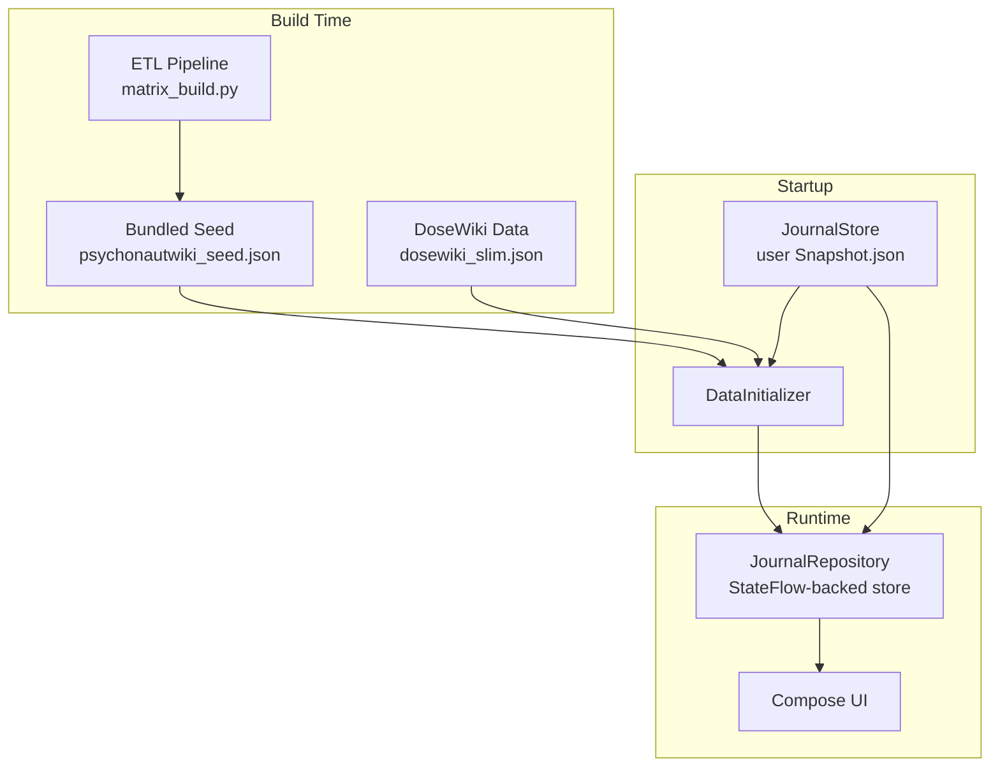

<div align="center">


# Nepenthe Journal

Offline-first journal for tracking psychoactive substance sessions, monitoring tolerance, and browsing reference data. Built with Compose Multiplatform.

No cloud, no accounts, no surveillance. Data lives on your device. Optional P2P sync between your own devices over LAN.

[](LICENSE)
[](https://github.com/Wolren/NepentheJournal/commits)
[](https://github.com/Wolren/NepentheJournal/issues)
[]()
[](gradle/libs.versions.toml)
[]()
[]()
[](.github/workflows)

</div>

---

## Problem

Existing substance tracking tools require accounts, upload data to servers, or lack structured session logging with tolerance tracking. Nepenthe Journal is a private, offline-first alternative: your data never leaves your devices. P2P sync connects your own devices directly over LAN with no cloud relay.

---

## Features

- [x] Session tracking with substances, doses, ROAs, check-ins, and timeline events
- [x] Substance reference database (325+ substances) with dosage, duration, interaction, and pharmacology data from multiple sources
- [x] Tolerance dashboard per substance based on last ingestion time and frequency
- [x] Activity heatmap showing session frequency over time
- [x] Dose duration curves (intensity-over-time bezier) for every substance route
- [x] Full-text search across sessions, substances, doses, notes, and effects
- [x] P2P sync between desktop and phone over LAN via Ktor (no cloud relay)
- [x] Custom theme editor with hex color pickers, card styles, background images, and opacity
- [x] Harm reduction reference (DoseWiki integrated)
- [x] Import/export (JSON, CSV) and auto-backup rotation
- [x] Offline-first: full functionality without internet

---

## Architecture

### Data Sources

Nepenthe Journal does NOT call the PsychonautWiki API at runtime. All substance reference data is pre-processed via an ETL pipeline and bundled as JSON seed files:

| Source | Data | Method |
|--------|------|--------|
| PsychonautWiki SMW | 297 substances, classes, effects, interactions, dose ranges | Semantic MediaWiki `action=ask` dump via `scripts/smw_dump.py` |
| PubChem | CIDs, molecular properties, synonyms | CID matching via PUG REST |
| Wikidata | DrugBank IDs, ChEBI IDs, UNII, ATC codes | SPARQL query via `wdq` |
| TripSit | Combination interactions, risk assessments | `scripts/fetch_tripsit.py` |
| ChEMBL | Bioactivity data (Ki, IC50, EC50) | ChEMBL REST API |
| IUPHAR/BPS GtoPdb | Ligand-target interactions (pKi, pIC50) | REST API from guidetopharmacology.org |
| PDSP Ki Database | Ki binding records (4,140+ records, 93 substances) | CSV import from NIMH PDSP |
| BindingDB | Affinity measurements (1,893+ records) | REST API by SMILES lookup |
| DoseWiki | Ingested substance effects and durations | Slim JSON from ETL pipeline |

The ETL pipeline lives at `scripts/matrix_build.py` and merges all sources into a single `JournalSnapshot` JSON seed. Run it with:

```bash
python scripts/matrix_build.py --refresh -i seed.json -o seed.json -v
```

Substances are baked in at build time: no API calls happen in the running app.

### Data Flow



Persistence uses a single JSON file (`JournalSnapshot`) with all documents serialized via kotlinx.serialization. Auto-backup rotation keeps the last 10 copies. Save retry with atomic writes prevents corruption.

### Navigation

Overlay-based navigation with bottom tabs and full-screen overlay editors. The navigation state is modeled as a sealed interface (`NavigationState`) for compile-time exhaustive `when` coverage.

- **Dashboard:** greeting, stats cards, activity heatmap, sessions trend chart, tolerance overview
- **Sessions:** session list with tag filters, favorites toggle, search, calendar access
- **Substances:** catalog with search, category chips, duration curves, pharmacology data, custom substance creation
- **Safer Use:** harm reduction reference cards (DoseWiki-based, no external links)
- **Settings:** theme editor, P2P sync controls, data import/export, backup management, substance library

Overlays replace the content area for editors, detail views, and the calendar.

### P2P Sync

LAN-based sync using Ktor (no cloud, no Couchbase Enterprise):

- **Host (JVM):** Ktor server advertises via mDNS (JmDNS), accepts push/pull sync requests
- **Client (all targets):** Ktor client pushes local changes and pulls remote changes
- **Transport:** HTTP REST + HMAC-SHA256 auth + optional WebSocket for live delta push
- **Resilience:** HTTP retry with exponential backoff, WS heartbeat/pong, reconnection logic, data validation gates
- All sync controls are in Settings under a collapsible "Device Sync" section

### Theme System

Modular, serializable theme system:

- `ThemeConfig`: all visual parameters (colors, card style, corner radius, background image, base theme)
- `ThemeManager`: observable `StateFlow<ThemeConfig>`, derives WCAG-compliant Material3 `ColorScheme`
- Contrast colors computed via relative luminance (WCAG): black or white text depending on background
- Presets: Forest (dark green) and Meadow (light green) defaults
- Persistent across sessions (stored as part of JournalSnapshot)

### Cross-Platform

Desktop (primary target), Android, and iOS share the same `commonMain` code. Platform-specific files (`desktopMain`, `androidMain`, `iosMain`) provide expect/actual declarations for file I/O, clipboard, back navigation, and window management. See `docs/CROSS_PLATFORM.md` for the full guide.

---

## Getting Started

### Prerequisites

- JDK 21+ (Temurin recommended)
- Android SDK (for Android builds)
- Gradle wrapper included

### Desktop (primary)

```bash
# Run with test data for UI verification
NEPENTHE_TEST_DATA=1 ./gradlew composeApp:run

# Run without test data (empty app)
./gradlew composeApp:run
```

The desktop app launches a native window via Compose Desktop. Test data mode populates sessions with varied substances and combos for UI debugging. Test data is deterministic (seed 42): same data every run.

### Android APK

```bash
./gradlew composeApp:assembleDebug -x checkDebugAarMetadata
```

APK lands at `composeApp/build/outputs/apk/debug/`. Side-load to device over WiFi or USB.

### Build Verification

```bash
# Compile targets
./gradlew composeApp:compileKotlinDesktop
./gradlew composeApp:compileDebugKotlinAndroid -x checkDebugAarMetadata

# Run all tests (convenience script)
bash scripts/run-tests.sh --all

# Run only fast unit tests
bash scripts/run-tests.sh
```

### Test Data

Enable test data via any of:

| Method | How |
|--------|-----|
| JVM flag | `-Dnepenthe.test-data=true` |
| Env var | `NEPENTHE_TEST_DATA=1` |
| Settings UI | Developer > "Load Test Data" button |

---

## Tech Stack

| Layer | Choice |
|-------|--------|
| UI Framework | Compose Multiplatform (JetBrains) 1.11.1 |
| Language | Kotlin 2.4.0 |
| Build System | Gradle 9.6.1 + AGP 9.3.0 |
| Persistence | JSON file via kotlinx.serialization, atomic writes + backup rotation |
| Networking | Ktor 3.5.1 (client + server) |
| Charts | Vico 3.x |
| Service Discovery | JmDNS 3.5.12 |
| Settings | multiplatform-settings 1.3.0 |
| Thread Safety | PlatformLock (expect/actual: synchronized on JVM, NSLock on iOS) |
| Test | kotlin.test (28 test files, 436 test methods) |

## CI/CD

| Workflow | Trigger | Purpose | Status |
|----------|---------|---------|--------|
| CI | Push/PR to master | Compile Desktop + Android, run tests, build APK | Desktop + Android |
| CodeQL | Push/PR + weekly (Mon) | Security analysis for Java only | Pass |
| Dependabot | Weekly | Auto-update Gradle + GitHub Actions dependencies | Pass |

> **iOS build:** not currently passing on CI. The iOS target is scaffolded with full expect/actual coverage and Compose Multiplatform setup, but requires a macOS build machine with Xcode. The Kotlin 2.4.0 ObjC interop layer has a known issue with the `Protocol` type in `kotlinx.cinterop` that affects generated ObjC protocol delegate bindings. Fixing this requires either a macOS environment or a downstream Kotlin patch.

---

## Limitations

- **Desktop is the primary target.** Android builds but requires manual side-loading. iOS is scaffolded but blocked by a Kotlin 2.4.0 interop issue on CI.
- **LAN-only sync.** P2P sync works between devices on the same local network. No remote relay or cloud tunnel.
- **Single-user.** The app has no multi-account or profile system. All data belongs to one user per install.
- **No encryption at rest.** Journal data is stored as a JSON file on disk. No built-in encryption layer.
- **Data sources are bundled.** Reference data is pre-processed at build time, not live-fetched. Update frequency depends on ETL pipeline runs.
- **Compose Multiplatform still has platform-specific quirks.** Desktop and Android share most code, but edge cases (file pickers, clipboard, window management, scrollbars) require platform-specific implementations.

---

## Contributing

Contributions are welcome. Read [CONTRIBUTING.md](CONTRIBUTING.md) before opening a pull request.

---

## License

GNU General Public License v3.0. See [LICENSE](LICENSE).

## Acknowledgments

- **PsychonautWiki Journal** by Isaak Hanimann ([GitHub](https://github.com/isaakhanimann/psychonautwiki-journal-android)): this project's feature reference and conceptual predecessor, licensed under GPL-3.0-or-later. Nepenthe Journal is a derivative work ported to Compose Multiplatform with a redesigned architecture and new features.
- **PsychonautWiki** ([psychonautwiki.org](https://psychonautwiki.org)): public substance reference data accessed via their Semantic MediaWiki API and bundled as seed data.
- **IUPHAR/BPS Guide to Pharmacology**: ligand-target interaction data.
- **PDSP Ki Database** (NIMH Psychoactive Drug Screening Program): Ki binding data.
- **BindingDB**: public affinity measurements.
