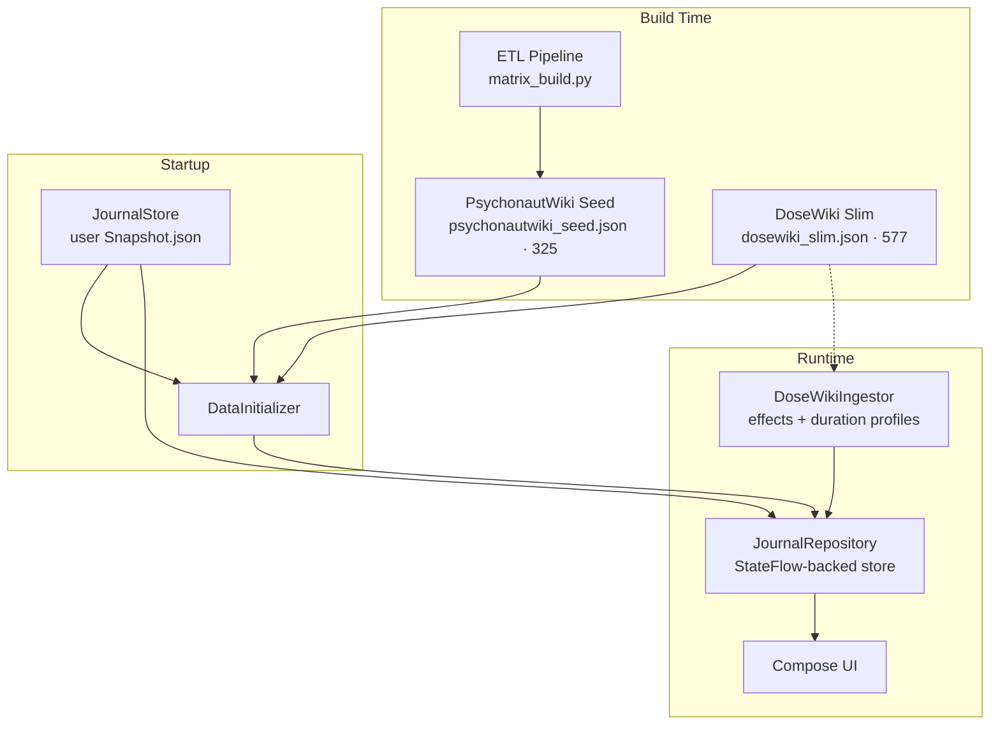

<div align="center">


# Nepenthe Journal

Offline-first journal for tracking psychoactive substance sessions, monitoring tolerance, and browsing a DoseWiki-powered substance reference. Built with Compose Multiplatform.

No cloud, no accounts, no surveillance. Data lives on your device. Optional P2P sync between your own devices over LAN.

[](LICENSE)
[](https://github.com/Wolren/NepentheJournal/commits)
[](https://github.com/Wolren/NepentheJournal/issues)
[]()
[](gradle/libs.versions.toml)
[]()
[]()
[](.github/workflows)
[](https://ko-fi.com/wolren)

</div>

---

## Problem

Existing substance tracking tools require accounts, upload data to servers, or lack structured session logging with tolerance tracking. Nepenthe Journal is a private, offline-first alternative: your data never leaves your devices. P2P sync connects your own devices directly over LAN with no cloud relay.

---

## Features

- [x] **DoseWiki reference catalog (primary data source):** 577 substances with dosage by route, duration stages, interaction charts, pharmacology, and subjective-effect profiles — bundled offline as CC0 open data
- [x] **One merged offline catalog:** DoseWiki records plus a PsychonautWiki-derived ETL seed (325 substances) are reconciled into a single catalog at startup — no reference API is ever called at runtime
- [x] Session tracking with substances, doses, ROAs, check-ins, and timeline events
- [x] Tolerance dashboard per substance based on last ingestion time and frequency
- [x] Activity heatmap showing session frequency over time
- [x] Dose duration curves (intensity-over-time bezier) for every substance route, built from DoseWiki duration profiles
- [x] Full-text search across sessions, substances, doses, notes, and effects
- [x] P2P sync between desktop and phone over LAN via Ktor (no cloud relay)
- [x] Custom theme editor with hex color pickers, card styles, background images, and opacity
- [x] Harm reduction guidance plus curated external resources (Safer Use tab)
- [x] Trip-report export in the [DoseWiki trip-report format](https://josiekins.xyz/html-craft/dosewiki-trip-report-format.html)
- [x] Import/export (JSON, CSV) and auto-backup rotation
- [x] Offline-first: journaling, bundled reference data, and P2P sync work without internet (the FDA drug-label card needs network, see below)

---

## Architecture

### Reference Data: DoseWiki (primary)

DoseWiki ([dose.wiki](https://dose.wiki/)) is the app's primary reference source. Its open-data substance index is processed by `scripts/dosewiki_slim.py` into `dosewiki_slim.json` — **577 substances**, every one carrying:

- **Dosage** — dose ranges per route of administration
- **Duration** — onset / peak / after-effects / total per route
- **Subjective effects** — notes, sensory, physical, and cognitive facets with attribution
- **Interactions** — with reasons (interaction risk data retains TripSit's non-commercial attribution)
- **Pharmacology** — pharmacodynamics, pharmacokinetics, and metabolites
- Plus summary, identification, classification, harm potential, legality, tolerance, and citations

The substance prose is released under **CC0 1.0** (see [DoseWiki's license](https://dose.wiki/docs/license)). The source index is fetched from https://dose.wiki/open-data/SubstanceIndex.json with a GitHub mirror fallback, and cached at `scripts/cache/SubstanceIndex.json`.

What the app builds from it:

- `DoseWikiIngestor` (commonMain) ingests the slim JSON into the **effects store** and builds each substance's **duration profile** — which powers the dose-duration curves and the session effect timeline
- The **substance catalog**: search, category chips from a 13-entry curated taxonomy (`DosewikiTaxonomy.kt`, `/dosewiki_taxonomy.json`), and detail screens showing dosage, duration, and effects
- **Trip-report export** in the DoseWiki trip-report format (`export/DoseWikiTripReport.kt`, with consent/age/size validation)

Four byte-identical copies of `dosewiki_slim.json` ship in the repo (`desktopMain`, `jvmMain`, and `iosMain` resources plus the `androidMain` assets); they are written in a single `scripts/dosewiki_slim.py` run so hashes stay equal, and CI verifies this.

### Reference Data: PsychonautWiki ETL Seed and Supporting Sources

Nepenthe Journal does NOT call any reference API at runtime. In addition to DoseWiki, a PsychonautWiki-derived ETL seed is pre-processed and bundled as JSON:

| Source | Data | Method |
|--------|------|--------|
| PsychonautWiki SMW | Substance classes, effects, interactions, dose ranges (325 substances in the current seed) | Semantic MediaWiki `action=ask` dump via `scripts/smw_dump.py` |
| PubChem | CIDs, molecular properties, synonyms | CID matching via PUG REST |
| Wikidata | DrugBank IDs, ChEBI IDs, UNII, ATC codes | SPARQL query via `wdq` |
| TripSit | Combination interactions, risk assessments | `scripts/fetch_tripsit.py` |
| ChEMBL | Bioactivity data (Ki, IC50, EC50) | ChEMBL REST API |
| IUPHAR/BPS GtoPdb | Ligand-target interactions (pKi, pIC50) | REST API from guidetopharmacology.org |
| PDSP Ki Database | Ki binding records (4,140+ records, 93 substances) | CSV import from NIMH PDSP |
| BindingDB | Affinity measurements (1,893+ records) | REST API by SMILES lookup |

The ETL pipeline lives at `scripts/matrix_build.py` and merges all sources into a single `JournalSnapshot` JSON seed. Run it with:

```bash
python scripts/matrix_build.py --input scripts/seed.json --output scripts/cache/unified_seed.json --verbose
```

`scripts/seed.json` (JournalSnapshot v3, 325 substances) is the canonical seed. The four bundled copies (`desktopMain` and `jvmMain` and `iosMain` resources plus `androidMain` assets `psychonautwiki_seed.json`) are byte-identical copies of it: copy the pipeline result over all of them in one run so hashes stay equal. CI checks this.

Substances are baked in at build time: no reference API calls happen in the running app, except the FDA drug-label card (`OpenFdaInteractionCard`), which queries api.fda.gov on demand and needs network.

### Data Flow



Persistence uses a single JSON file (`JournalSnapshot`) with all documents serialized via kotlinx.serialization. Versioned backup rotation keeps 6 copies (`.bak` plus `.bak.1` through `.bak.5`; see `save()` in `composeApp/src/desktopMain/kotlin/app/journal/data/JournalStoreDesktop.kt`). Save retry with atomic writes prevents corruption.

### Navigation

Overlay-based navigation with bottom tabs and full-screen overlay editors. The navigation state is modeled as a sealed interface (`NavigationState`) for compile-time exhaustive `when` coverage.

- **Dashboard:** greeting, stats cards, activity heatmap, sessions trend chart, tolerance overview
- **Sessions:** session list with tag filters, favorites toggle, search, calendar access
- **Substances:** DoseWiki-powered catalog with search, category chips, dosage and duration detail, duration curves, pharmacology data, custom substance creation
- **Safer Use:** harm reduction guidance and curated external resources (DoseWiki, PsychonautWiki, Erowid, TripSit, DanceSafe, RollSafe)
- **Settings:** theme editor, P2P sync controls, data import/export, backup management, substance library

Overlays replace the content area for editors, detail views, and the calendar.

### P2P Sync

LAN-based sync using Ktor (no cloud, no Couchbase Enterprise):

- **Host (JVM):** Ktor server advertises via mDNS (JmDNS), accepts push/pull sync requests on port 4984 by default (`SyncConfig.DEFAULT_PORT`)
- **Client (all targets):** Ktor client pushes local changes and pulls remote changes
- **Transport:** HTTP REST + HMAC-SHA256 auth + optional WebSocket for live delta push
- **Pagination:** pulls use composite (timestamp, id) cursors, so bulk data with tied timestamps (e.g. bundled seed rows) transfers completely; the sync cursor only advances after a fully drained pull
- **Resilience:** HTTP retry with exponential backoff, WS heartbeat/pong, reconnection logic, data validation gates
- All sync controls are in Settings under a collapsible "Device Sync" section

### Theme System

Modular, serializable theme system:

- `ThemeConfig`: all visual parameters (colors, card style, corner radius, background image, base theme)
- `ThemeManager`: observable `StateFlow<ThemeConfig>`, derives WCAG-compliant Material3 `ColorScheme`
- Contrast colors computed via relative luminance (WCAG): black or white text depending on background
- Presets: Forest, Ocean, Sunset, Ember, Midnight, Mono (see `ThemePresets.all` in `ThemeConfig.kt`)
- Persistent across sessions (stored as part of JournalSnapshot)

### Cross-Platform

Desktop (primary target), Android, and iOS share the same `commonMain` code. Platform-specific files (`desktopMain`, `androidMain`, `iosMain`) provide expect/actual declarations for file I/O, clipboard, back navigation, and window management. See `docs/CROSS_PLATFORM.md` for the full guide.

---

## Getting Started

### Prerequisites

- JDK 21+ (Temurin recommended)
- Android SDK (for Android builds)
- macOS + Xcode (for the iOS target)
- Gradle wrapper included

### Desktop (primary)

```bash
# Run with test data for UI verification
NEPENTHE_TEST_DATA=1 ./gradlew composeApp:run

# Run without test data (empty app)
./gradlew composeApp:run

# Windows: use gradlew.bat instead of ./gradlew
```

The desktop app launches a native window via Compose Desktop. Test data mode populates sessions with varied substances and combos for UI debugging. Test data is deterministic (seed 42): same data every run.

Desktop keyboard shortcuts: Ctrl+F opens search, Ctrl+N starts a new live session, Esc goes back.

### Android APK

```bash
./gradlew composeApp:assembleDebug -x checkDebugAarMetadata
```

APK lands at `composeApp/build/outputs/apk/debug/`. Side-load to device over WiFi or USB.

### Build Verification

```bash
# Compile targets
./gradlew composeApp:compileKotlinDesktop
./gradlew composeApp:compileDebugKotlinAndroid -x checkDebugAarMetadata

# Run all tests (convenience script)
bash scripts/run-tests.sh --all

# Run only fast unit tests
bash scripts/run-tests.sh
```

On Windows, run the Gradle tasks directly with `gradlew.bat` (the helper script is bash).

### Test Data

Enable test data via any of:

| Method | How |
|--------|-----|
| JVM flag | `-Dnepenthe.test-data=true` |
| Env var | `NEPENTHE_TEST_DATA=1` |
| Settings UI | Developer > "Load Test Data" button |

---

## Tech Stack

| Layer | Choice |
|-------|--------|
| UI Framework | Compose Multiplatform (JetBrains) 1.11.1 |
| Language | Kotlin 2.4.0 |
| Build System | Gradle 9.7.1 + AGP 9.3.1 |
| Reference Data | DoseWiki (CC0, 577 substances) + PsychonautWiki-derived ETL seed (325 substances) |
| Persistence | JSON file via kotlinx.serialization, atomic writes + backup rotation |
| Networking | Ktor 3.6.0 (client + server) |
| Charts | Vico 3.3.1 |
| Image Loading | Coil 3.6.3 |
| Service Discovery | JmDNS 3.6.3 |
| Settings | multiplatform-settings 1.3.0 |
| Thread Safety | PlatformLock (expect/actual: synchronized on JVM, NSLock on iOS) |
| Test | kotlin.test (59 test files, 610 test methods) |

## CI/CD

| Workflow | Trigger | Purpose | Status |
|----------|---------|---------|--------|
| CI | Push/PR to master | Verify seed hashes, compile Desktop + Android, run tests, build APK | Desktop + Android |
| CI (iOS) | Manual (`workflow_dispatch`) | Compile the iOS Kotlin framework (simulator + device) and verify the Xcode project on macOS | On demand until proven green |
| CodeQL | Push/PR + weekly (Mon) | Security analysis for Java only | Pass |
| Dependabot | Weekly | Auto-update Gradle + GitHub Actions dependencies | Pass |

> **iOS status:** the iOS job runs on a macOS runner, compiles the Kotlin framework for both simulator and device, then builds the Xcode project. It is gated to manual dispatch until it is reliably green; see the [Actions tab](../../actions) for current results.

---

## Limitations

- **Desktop is the primary target.** Android builds but requires manual side-loading. iOS builds require macOS/Xcode, and its CI verification runs on demand.
- **LAN-only sync.** P2P sync works between devices on the same local network. No remote relay or cloud tunnel.
- **Single-user.** The app has no multi-account or profile system. All data belongs to one user per install.
- **No encryption at rest.** Journal data is stored as a JSON file on disk. No built-in encryption layer.
- **Reference data is bundled.** DoseWiki and the ETL seed are pre-processed at build time, not live-fetched. Update frequency depends on pipeline runs.
- **Compose Multiplatform still has platform-specific quirks.** Desktop and Android share most code, but edge cases (file pickers, clipboard, window management, scrollbars) require platform-specific implementations.

---

## Contributing

Contributions are welcome. Read [CONTRIBUTING.md](CONTRIBUTING.md) before opening a pull request.

---

## License

Code: GNU General Public License v3.0. See [LICENSE](LICENSE).

Bundled reference data has its own terms (see [NOTICE](NOTICE)): DoseWiki substance prose is [CC0 1.0](https://dose.wiki/docs/license); interaction risk data derived from TripSit retains TripSit's non-commercial attribution; PsychonautWiki-derived seed data is sourced from the public Semantic MediaWiki API and used under fair use / public data principles, with attribution below.

## Acknowledgments

- **DoseWiki** ([dose.wiki](https://dose.wiki/)): the primary reference source — dosage, duration, interactions, pharmacology, and subjective effects for 577 substances, released as CC0 open data.
- **PsychonautWiki Journal** by Isaak Hanimann ([GitHub](https://github.com/isaakhanimann/psychonautwiki-journal-android)): this project's feature reference and conceptual predecessor, licensed under GPL-3.0-or-later. Nepenthe Journal is a derivative work ported to Compose Multiplatform with a redesigned architecture and new features.
- **PsychonautWiki** ([psychonautwiki.org](https://psychonautwiki.org)): public substance reference data accessed via their Semantic MediaWiki API and bundled as seed data.
- **TripSit** ([tripsit.me](https://tripsit.me)): combination interaction and risk-assessment data.
- **IUPHAR/BPS Guide to Pharmacology**: ligand-target interaction data.
- **PDSP Ki Database** (NIMH Psychoactive Drug Screening Program): Ki binding data.
- **BindingDB**: public affinity measurements.
